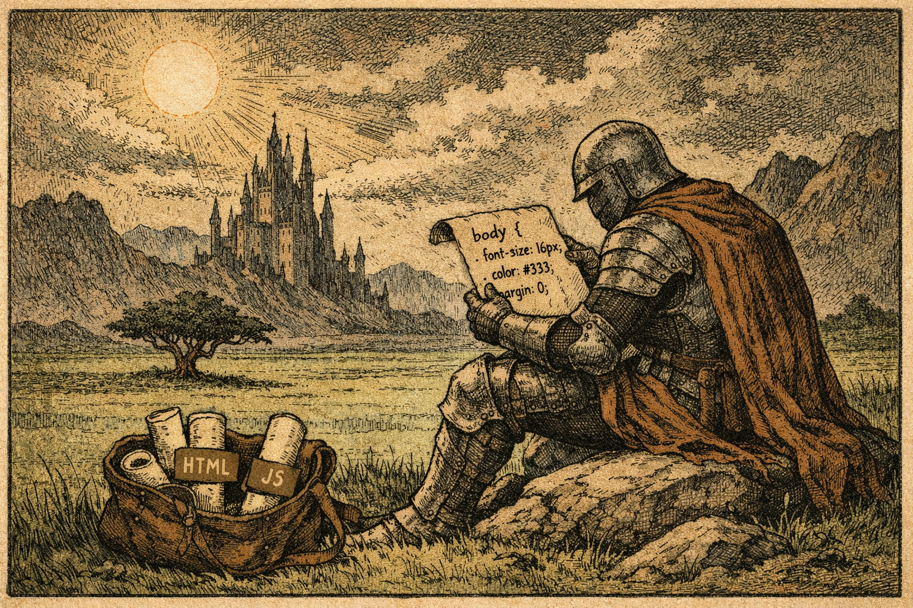

# Курс «Основы веб-разработки: HTML, CSS, JavaScript» 🖥️

## 🎯 Цель курса

Научиться создавать полноценные веб-страницы: от простой структуры до интерактивных элементов. К концу вы соберёте свой первый сайт руками.

## 📋 План обучения

Курс разбит на короткие уроки с теорией и ДЗ. Каждый — отдельная тема, шаг за шагом.

### Уроки HTML 📄

* **Урок 1: Что такое HTML** — документ, теги, doctype.
* **Урок 2: Заголовки и параграфы** — h1-h6, p, strong, em.
* **Урок 3: Списки** — ul, ol, li, dl.
* **Урок 4: Ссылки** — a href, target, rel.
* **Урок 5: Изображения** — img src, alt, width/height.
* **Урок 6: Таблицы** — table, tr, th, td.
* **Урок 7: Формы** — form, input, textarea, button.

### Уроки CSS 🌈

* **Урок 8: Подключение CSS** — inline, internal, external.
* **Урок 9: Селекторы** — теги, классы, ID, универсальный.
* **Урок 10: Цвета и шрифты** — color, background, font-family/size.
* **Урок 11: Отступы** — margin, padding, border.
* **Урок 12: Box-model** — ширина, высота, box-sizing.
* **Урок 13: Flexbox** — display:flex, justify-content, align-items.
* **Урок 14: Адаптивность** — media queries, viewport.

### Уроки JavaScript ⚙️

* **Урок 15: Переменные** — let, const, var, типы данных.
* **Урок 16: Условия и циклы** — if/else, switch, for/while.
* **Урок 17: DOM** — document.getElementById, querySelector.
* **Урок 18: События** — addEventListener, click, input.

## 📝 Домашние задания

Курс включает в себя по одному дз на каждую тему. Выполняйте их последовательно — каждое закрепляет пройденные темы.

- ДЗ 1 - [Настройка и структура](https://rybka4tundra.github.io/HtmlCssCourseRussian/src/Practice/HW1).
- ДЗ 2 - [Текст и изображения](https://rybka4tundra.github.io/HtmlCssCourseRussian/src/Practice/HW2).
- ДЗ 3 - [Стили и упаковка](https://rybka4tundra.github.io/HtmlCssCourseRussian/src/Practice/HW3).

## 🚶‍♂️ Как проходить уроки

1. **Читай теорию** — короткие объяснения с кодом в VS Code. 📖
2. **Тестируй примеры** — копируй в редактор, открывай в браузере. 💻
3. **Делай ДЗ** — по ссылке выше, пиши код самостоятельно. ✍️
4. **Сдавай лично** — показывай преподу на занятии, получай фидбек. 👨‍🏫
5. **Иди дальше** — после правок переходи к следующему. ➡️